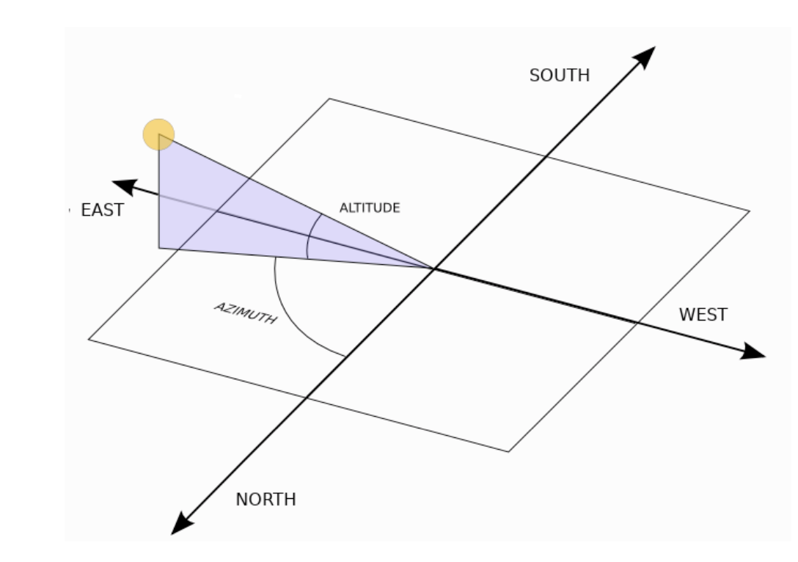

#### CONTENTS OF THIS FILE
---------------------

 * Introduction
    * How it works
    * Application layout
 * Requirements
 * How do I get set up?
 * Testing the app
 * Troubleshooting
 * FAQ
 * Who do I talk to? 
 * Things to improve

#### **Introduction**
This app was built as a possible solution to a problem provided by Caliber Data Labs.

This app recieved a POST request with some metadata from an image, and should return a response that verifies if there is a possibility that image has glare (i.e direct sun-glare conditions) in it or not.

The app is able to achieve this by calculating the Azimuth and Altitude of the sun.


An image is assumed to have glare if both the conditions below are met:
1) Azimuthal difference between sun and the direction of the car travel (and hence the
direction of forward- facing camera) is less than 30 degrees AND
2) Altitude of the sun is less than 45 degrees.
<br></br>

##### **How it works**
Here is what the post request looks like

```json
Request: POST 0.0.0.0:5000/detect_glare
    {
    “lat”: 49.2699648
    “lon”: -123.1290368 
    “epoch”: 1588704959.321 
    “orientation”: -10.2
    }
```

Here is what the response from the request looks like
```json
Response:
    {
    “glare”: “false”,
    }
```

##### **Main functionality**
Here is a snippet from app.py, to show how the "/detect_glare" route works
```python
@app.route("/detect_glare" , methods=["POST"])
@expects_json(schema)
def check_glare():
    
    ...

    glare = True if az<30 and alt<45 else False
    
    return jsonify({
        "glare": glare
        })
```


##### **Other functionality**
Some other routes for testing and future work.

The "/ping" route for testing that our application is running properly.
```python
# for testing
@app.route("/ping")
def ping():

    return jsonify({"res": "pong"})
```

The "/" route should ideally render a page that allows you input the data manually and get a response on the page. This is still in the works.
```python
@app.route("/")
def index():

    return render_template("index.html")
```
**Note:** This route is not fully functional.<br></br>

##### **Application Layout** ###

	camera_glare/
		app.py	- Implements the interface to our app
		glare_checker.py - A custom library build for easier expansion of the apps functionality
		__init__.py

        static/
            js/
                app.js
        templates/
            index.html
	
    tests/
		test.py

    __init__.py
    README.md
    pyproject.toml - similar to the requirements.txt - contains the dependencies for this project.
    software-engineering-glare-python.pdf
<br></br>

#### **Requirements**
The [pyproject.toml](pyproject.toml) file has a list of all the packages used.

#### **How do I get set up?** ###
**Note**: The following setup makes use of a package manager called "poetry". If you prefer to use pip, you can refer to the [requirements.txt](requirements.txt) file.

1) First step is to unzip the folder and copy into an empty directory.

2) Next step is to install the necessary dependencies. For the package management. I used a library called "poetry". More can be found here [Poetry docs](https://python-poetry.org/docs/).

3) Once Poetry is installed, you can run the following commands to get up and running.
```cmd
poetry install 
poetry shell
```
4) This will initialize the project and install all the dependencies. It is able to do this by accessing the [pyproject.toml](pyproject.toml) file. After this it will create an environment for the project.

5) You can then run the app inside the poetry environment by running the command as you would inside the poetry shell.

```cmd
python app.py
```
<br></br>
#### **Testing the app**
Testing the functionality of the app involves utilizing the unittest library to make calls to our API endpoint, and verifying the result. There are three tests being run here:


1) Tests the "/ping" route in our api, to make sure its up and running
```python
def test_ping(self):
    ...
```
2) This test sends a request that contains valid data in the body, similar to the one [Here](#how-it-works), and expects a reponse with code=200.
```python
def test_check_flare(self):
    ...
    self.assertEqual(response.status_code, 200)
    self.assertEqual(data, {'glare': False})
```
3) The final test sends a request that contains invalid data in the body, 
```json
    {
    “lat”: 105.2699648
    “lon”: -123.1290368 
    “epoch”: 1588704959.321 
    “orientation”: -10.2
    }
```
Note: The lat is not within the -90 to 90 range (i.e 105.2699648 not in range)
```python
def test_check_flare_invalid_data(self):
    ...
    self.assertEqual(response.status_code, 400)
```
Hence, a response with code=400 should be returned for invalid data.

##### **Running the test**
Navigate into the tests folder and run the following command
```cmd
python test.py
```
**Note**: App does not need to be running before the test command above

#### **Configuration** #####

Look in the [pyproject.toml](pyproject.toml) to verify the info
* Dependencies
	* python_version = "3.8"
	* python = "^3.7"
    * Flask = "^1.1.2"
    * flask-expects-json = "^1.5.0"
    * unittest = "^0.0"
    * astropy = "^4.2"


#### **Troubleshooting**


#### **FAQ**
How do I run the app?
- Refer to the [How do I get set up?](#how-do-i-get-set-up) section

How do I test the app?
- Refer to the [How do I get set up?](#how-do-i-get-set-up) section


#### **Things to improve** ###
- Do some more research on more acurate algorithms.
- Maybe combine the result from multiple algoriths.
- possibility of adjusting for height of the camera.
- Allow the app to handle batch processing
- Continue work on the webpage, to allow for manual input. can be valuable for testing edge cases.

#### **Limitations**
- This app is only as accurate as the package used for the project.
- It also doesn't account for other factors that might affect glare, such as atmospheric conditions(eg cloud position, pressure, temperature etc.)

#### **Who do I talk to?** ###

* dami.osayomi@gmail.com
* Other community or team contact
* Caliber Data Labs

